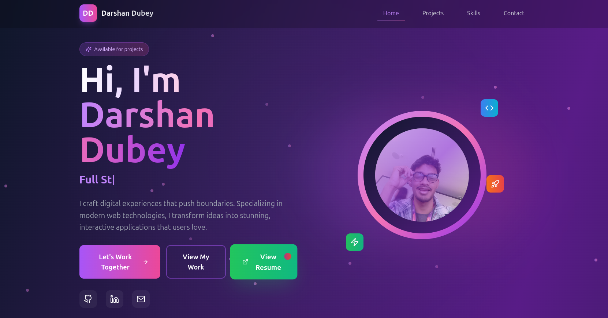
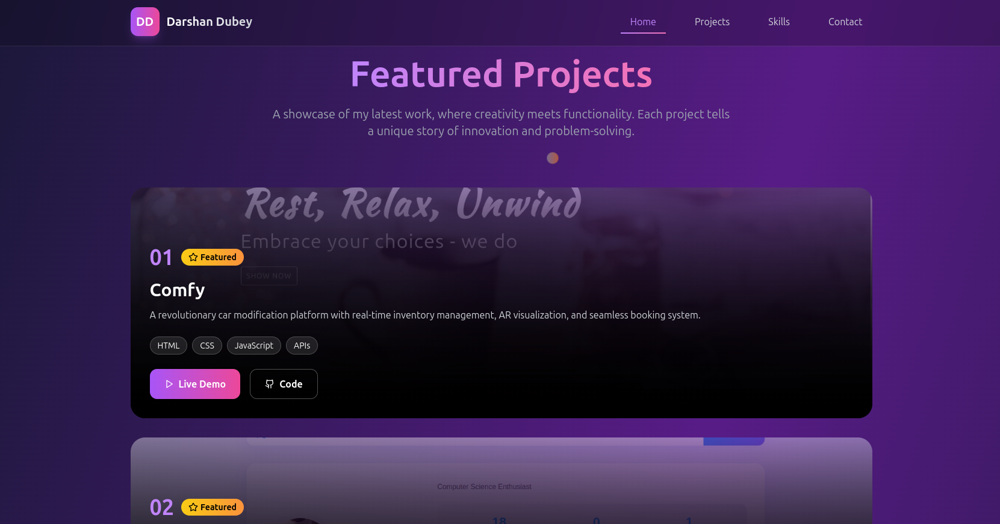
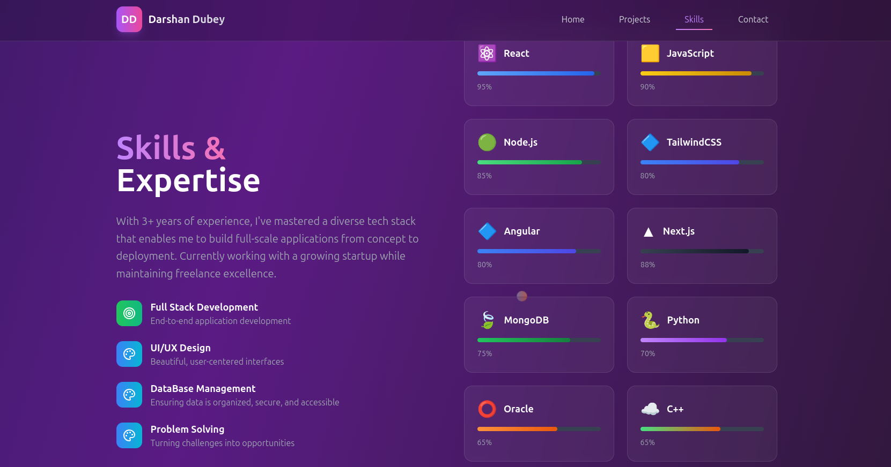

<div align="center">

# 🚀 Modern Developer Portfolio

</div>

<div align="center">



**A stunning, interactive portfolio that breaks the boundaries of traditional web design**

[](https://reactjs.org/)
[](https://tailwindcss.com/)
[](https://lucide.dev/)

[🌟 Live Demo](https://portfolio-peach-alpha-78.vercel.app/) • [📖 Documentation](#-features) • [🛠️ Installation](#-installation) • [🎨 Customization](#-customization)

</div>

---

## ✨ What Makes This Portfolio Special?

This isn't just another portfolio website. It's a **digital experience** that combines cutting-edge design with smooth functionality to create something truly memorable.

### 🎯 The "Wow Factor"
- **Custom Cursor Animation** - Interactive cursor that follows your every move
- **Floating Particle System** - Dynamic background elements that breathe life into the design
- **Typewriter Animation** - Engaging text effects that capture attention
- **Smooth Scroll Interactions** - Buttery smooth navigation between sections
- **Glassmorphism UI** - Modern blur effects and transparency layers
- **Gradient Magic** - Eye-catching color combinations throughout

---

## 🎬 Preview

<div align="center">

### Hero Section
*Animated typewriter effect with floating elements and custom cursor*


### Project Showcase
*Interactive project cards with hover effects and tech stack displays*



### Skills Visualization
*Animated progress bars and skill ratings with gradient backgrounds*



</div>

---

## 🚀 Features

- #### 🎨 **Visual Masterpiece**

- #### ⚡ **Smooth Animations**

- #### 📱 **Responsive Excellence**

- #### 🛠️ **Developer Experience**
---

## 📦 Installation

### Quick Start (5 minutes)

```bash
# Clone this masterpiece
git clone https://github.com/mailmeatdarshan/Portfolio.git

# Navigate to the project
cd Portfolio

# Install dependencies
npm install

# Launch the experience
npm start

# Open your browser to http://localhost:3000
# Prepare to be amazed! ✨
```

### Alternative Setup

```bash
# Using Yarn
yarn install && yarn start

# Using pnpm (recommended for speed)
pnpm install && pnpm start
```

---

## 🛠️ Built With

<div align="center">

| Technology | Purpose | Why It's Awesome |
|------------|---------|------------------|
|  | Frontend Framework | Component-based architecture |
|  | Styling | Utility-first CSS framework |
|  | Icons | Beautiful, consistent icons |
|  | Programming Language | Modern ES6+ features |

</div>

---

## 🚀 Deployment

### Vercel (Recommended)
```bash
# Install Vercel CLI
npm i -g vercel

# Deploy with one command
vercel

# Your portfolio is now live! 🎉
```

### Netlify
```bash
# Build the project
npm run build

# Drag and drop the 'build' folder to Netlify
# Or connect your GitHub repo for auto-deployment
```

---

## 🎯 Performance

This portfolio is built for speed and user experience:

- ⚡ **Lighthouse Score**: 95+ in all categories
- 🚀 **First Contentful Paint**: < 1.5s
- 📱 **Mobile Optimized**: Perfect responsive design
- 🎨 **Smooth Animations**: 60fps consistent performance
- 📦 **Bundle Size**: Optimized for fast loading

---

## 🤝 Contributing

Found a bug? Have an awesome idea? Contributions are welcome!

1. **Fork** the repository
2. **Create** your feature branch (`git checkout -b feature/AmazingFeature`)
3. **Commit** your changes (`git commit -m 'Add some AmazingFeature'`)
4. **Push** to the branch (`git push origin feature/AmazingFeature`)
5. **Open** a Pull Request

---

## 📝 License

This project is licensed under the MIT License - see the [LICENSE](LICENSE) file for details.

---

## 🌟 Show Your Support

If this portfolio helped you create something amazing, please give it a ⭐️!

<div align="center">

### Made with ❤️ by Dubey, for dub-lopers

**[⬆ Back to Top](#-modern-developer-portfolio)**

---

*"Design is not just what it looks like and feels like. Design is how it works."* - Steve Jobs

</div>